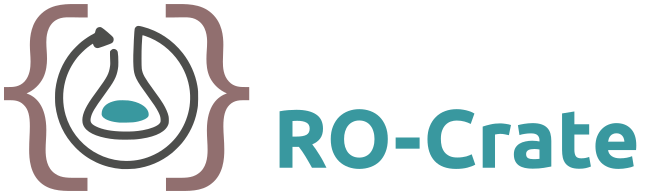

> ## Overview
> **Presentation: Introduction to RO-Crate and JSON** (15 minutes)
> * Gathering diverse outputs; Aims of FAIR research objects   
> * Importance of profiles: community-defined content checklists
> 
> **Tutorial: Packaging Data with RO-Crates** (45 minutes)
> 
> * Turning a folder into an RO-Crate; Make metadata descriptors  
> * Describe the root; Add cross-references; Authorship  
> * Data and contextual entities; Visualize, validate, convert

## Learning objectives

After completing the RO-Crates section of the tutorial, learners will be able to:

* Construct an RO-Crate by hand using JSON
* Describe each part of the Research Object
* Use basic JSON-LD to create FAIR metadata
* Connect different parts of the Research Object using identifiers

## Audience prerequisites

Before attending the RO-Crates section of the tutorial, learners should already have:

* Files and folder organization and using an editor/IDE
* Familiarity with JSON file format

This part of the tutorial is meant to be read along with the [RO-Crate specification](https://www.researchobject.org/ro-crate/1.1/), which learners are suggested to browse in advance.

## Presentations

Presentations will be adapted from:

- [Introduction to RO-Crate](https://docs.google.com/presentation/d/1KHKpi0XyAf3WYgtJes3js9d2rJyYx_hh/edit#slide=id.p1)
- [A Very Brief Introduction to JSON-LD](https://docs.google.com/presentation/d/1aJhCsi0zPfBuI59EwCIHclbrrry03R_i/edit#slide=id.p1)

## Tutorial

The tutorial will follow:
- [Packaging data with RO-Crates](https://www.researchobject.org/packaging_data_with_ro-crate/)