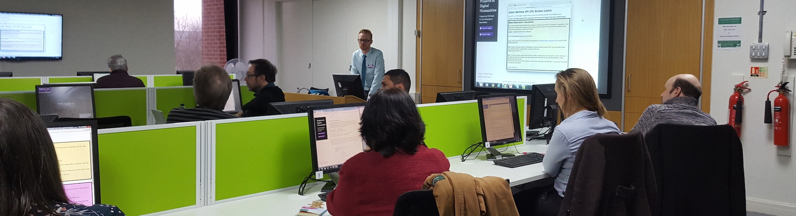

Website for the [ACM REP '25](https://acm-rep.github.io/2025/) Tutorial 1 "Improving FAIRability of your research outcomes with RO-Crates and Bioschemas", by:

- **Phil Reed**, Research Community and Training Manager, The University of Manchester (UK)
- **Abigail Miller**, Principal Software Engineer for JAX Data Science, The Jackson Laboratory (USA)

The instructors are adapting materials produced by **Stian Soiland-Reyes** and **Leyla Jael Castro**, with additional thanks to **Eli Chadwick**, **Alex Hambley** and **Doug Lowe**.

See the [about page](about) for abstract, learning objectives, intended audience, and audience prerequisites.

## Tutorial delivery

**Date**: Tuesday, July 29th 2025, 9am to 12.30pm Pacific Time (UTC -7) [(convert to your time zone)](https://www.timeanddate.com/worldclock/converter.html?iso=20250729T160000&p1=256)

**Location**: hybrid

- In-person participants: [**Allard 121**](https://allard.ubc.ca/about-us/allard-hall) (UBC, Vancouver, Canada)
  - *We acknowledge that the UBC Point Grey campus is situated on the traditional, ancestral and unceded territory of the xwmə0–kwəy’əm (Musqueam).*
- Remote participants: use the ACM REP 25 **Main Track Zoom link**, see email sent 2025-07-25.
  - If that fails, we have a back-up ready 

| Times (PDT)     | Topic                                        |
|:----------------|:---------------------------------------------|
| 09:00 - 09:35   | [1. Introduction, JSON-LD](1_introduction)   |
| 09:35 - 10:15   | [2. Bioschemas](2_bioschemas)                |
| (10:15 - 10:45) | (Break)                                      |
| 10:45 - 12:00   | [3. RO-Crate](3_ro-crate)                    |
| 12:00 - 12:25   | [4. Group discussions, HDR UK](4_discussion) |
| 12:25 - 12:30   | 5. Wrap up                                   |

Overall, the format of the tutorial will be short presentations preceding hands-on code tutorials, followed by a group discussion to consolidate learning and establish next steps. 
In more detail, the two practical sessions will be delivered by a qualified Carpentries instructor and will follow their evidence-based pedagogy, designed especially for teaching technical concepts. 
There are exercises and clear signposting throughout. 
Slides-based presentations are limited to 15 minutes. 
Participants are encouraged to bring their own data to apply the concepts to, where the familiarity will aid with comprehension. 
There is a coffee break in the middle of the tutorial.    

All materials are licensed under [CC-BY 4.0](https://creativecommons.org/licenses/by-sa/4.0/) by their respective authors.

Special thanks to [Heath Data Research UK](https://www.hdruk.ac.uk/) (HDR UK) for supporting this tutorial.
HDR UK's mission is to unite the United Kingdom's health data to enable discoveries that improve people's lives. 
They are leading work to improve access to data by researchers to improve prevension, care and treatments, helping people lead longer, healthier lives. 
We will look at the how RO-Crates and FAIR data principles are supporting HDR UK's mission.
